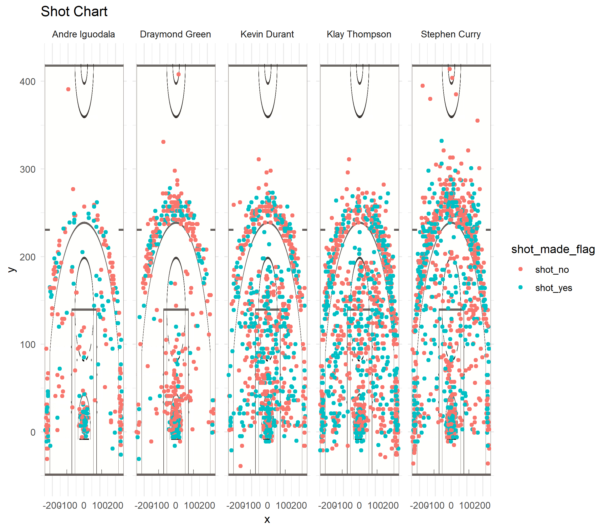

Workout 1
================
Jameson Hohbein
March 15, 2019

Introduction
============

In the past, we have analyzed data like we would find in the NBA by looking at a series of numbers. It would take to aggregate the data and was subject to error. Well I am here to say no more. New technologies have allowed us to quickly aggregate data with little to no chance of human error. In addition to these new methods, we are now also able to quickly visualize NBA data in ways that were never able to do before efficiently. This report will go into the details of the shooting records of some of the best players on the Golden State Warriors while also allowing us to easily visualize this data. In the end, we will better understand the records of these players.

Background
==========

Stephen Curry, Kevin Durant, Draymond Green, Klay Thompson, and Andre Iguodala are some of the best players in the NBA on one of the best teams in the NBA; the Golden State Warriors. In 2016, the Golden State Warriors had a successful season, placing first in the Western Conference. But how well did these players do individually in the 2016 season? What kind of shots did they make? What kind of shots did they miss? What were the chances of making a shot when looking at where they shot? These are all questions we can answer by aggregating NBA data.

As we see on the plot below, we have shots taken by the players in the 2016. You can see where they were shots were taken on the court and see that the green plots mark a successful shot and the red dots mark a miss. 

Players
=======

Stephen Curry
-------------

Curry has become one of the most well known players in the NBA, also one of the highest paid. Being shorter than the average NBA player, he is well known for his speed on the court and impressive shots. Curry is not afraid to take some pretty far shots as seen from the plot, he even makes some of them. When compared to the other players on the Golden State Warriors, Curry is a player who is not afraid to shoot his shot and often has the confidence to back it up making him a valuable player on the court.

Kevin Durant
------------

Kevin Durant is undoubtly one of the most valuable players on the Golden State Warriors. He has one of the highest successful shot rates in the NBA and has shown that he can successfully make shots just about anywhere on the court. When the warriors are down on their luck, you can always expect Durant to come through and deliver a solid performance.

Draymond Green
--------------

Draymond Green is another solid player on the Golden State Warriors. He brings crowds and impresses everyone with his playing and shooting capabilities. He is a three times NBA allstar and a very valuable member to the Golden State Warriors.

Klay Thompson
-------------

Klay Thompson is an extremeley successful player on the Golden State Warriors. He is not afraid to make tough shots and has proven to be one of the best shooters in all of NBA history. His skills are without a doubt, legendary.

Andre Iguodala
--------------

Andre Iguodala is one of the defensive legends of the NBA. Although he is set to retire soon, his defensive game is still top notch and will be remembered as one of the best.

    ## Warning: package 'dplyr' was built under R version 3.5.2

    ## 
    ## Attaching package: 'dplyr'

    ## The following objects are masked from 'package:stats':
    ## 
    ##     filter, lag

    ## The following objects are masked from 'package:base':
    ## 
    ##     intersect, setdiff, setequal, union

Two Pointer Statistics
======================

When aggregating and sorting the data, we see that Andre has the highest percentage of successful two pointers followed by Kevin Durant. Andre took significantly less total shots than any other player, however we he takes those shots he it more than half of the time successful.

| name           |  total|  made|  perc\_made|
|:---------------|------:|-----:|-----------:|
| Andre Iguodala |    210|   134|    63.80952|
| Kevin Durant   |    643|   390|    60.65319|
| Stephen Curry  |    563|   304|    53.99645|
| Klay Thompson  |    640|   329|    51.40625|
| Draymond Green |    346|   171|    49.42197|

Three Pointer Statistics
========================

When looking at the aggregated and sorted three point data, Klay Thompson takes the crown of not only having the highest success rate, but also having one of the most taken three pointer shots in 2016 followed by Curry. The data shows that both of these players are phenominal at what they do.

| name           |  total|  made|  perc\_made|
|:---------------|------:|-----:|-----------:|
| Klay Thompson  |    580|   246|    42.41379|
| Stephen Curry  |    687|   280|    40.75691|
| Kevin Durant   |    272|   105|    38.60294|
| Andre Iguodala |    161|    58|    36.02484|
| Draymond Green |    232|    74|    31.89655|

Total Point Statistics
======================

If we look at the aggregated and sorted data for all types of shots in the 2016 season, Kevin Durant takes the crown for having the highest success rate. At 54% and shooting the third most shots of the five, he is someone the Golden State Warriors cannot aford to lose.

| name           |  total|  made|  perc\_made|
|:---------------|------:|-----:|-----------:|
| Kevin Durant   |    915|   495|    54.09836|
| Andre Iguodala |    371|   192|    51.75202|
| Klay Thompson  |   1220|   575|    47.13115|
| Stephen Curry  |   1250|   584|    46.72000|
| Draymond Green |    578|   245|    42.38754|

Summary
=======

In conclusion, this report displays the aggregated data of five players on the Golden State Warrior in the 2016 season. We not only have the statistics surrounding how many times the players shot, how many times they made the shot, and what their percentage of success is, we also plot on a graph where these shots took place on the court and whether or not they were successful. We also break the data down between the types of shots. Two pointers shots, three pointer shots, along with total shots are on display for each player in the 2016 season. Using these displays and statistics allows us to evaluate the player's performance in the 2016 season along with gives us a good predicting tool for how they may perform in the coming years. If the reader were to remember anything from this article it would be that we have technologies that allow us to efficiently aggregate and analyize large data sets such as the NBA.
